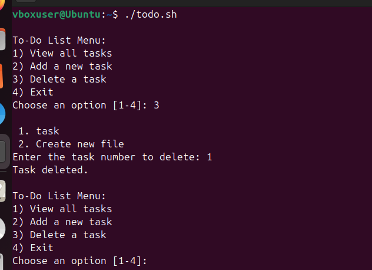

# Shell Scripting Task

This is the fourth project in the KodeCamp DevOps learning track. The purpose of this project is to help learnings understand the concept of shell scripting by creating a simple interactive to-do list manager that users to view, add and delete tasks via the terminal.

## Task 1

* Create a script named **_todo.sh_**. Run `nano todo.sh`.
* Populate the file with your code in the nano editor.

The code is provided below:

```
#!/bin/bash

TODO_FILE=~/todo.txt

# Ensure the todo file exists
touch "$TODO_FILE"

while true; do
    echo
    echo "To-Do List Menu:"
    echo "1) View all tasks"
    echo "2) Add a new task"
    echo "3) Delete a task"
    echo "4) Exit"
    echo -n "Choose an option [1-4]: "
    read choice

    case $choice in
        1)
            echo
            echo "Your Tasks:"
            if [[ ! -s "$TODO_FILE" ]]; then
                echo "No tasks found."
            else
                nl -w2 -s'. ' "$TODO_FILE"
            fi
            ;;
        2)
            echo -n "Enter your new task: "
            read task
            if [[ -n "$task" ]]; then
                echo "$task" >> "$TODO_FILE"
                echo "Task added."
            else
                echo "Task cannot be empty."
            fi
            ;;
        3)
            echo
            nl -w2 -s'. ' "$TODO_FILE"
            echo -n "Enter the task number to delete: "
            read tasknum
            if [[ "$tasknum" =~ ^[0-9]+$ ]]; then
                sed -i "${tasknum}d" "$TODO_FILE"
                echo "Task deleted."
            else
                echo "Invalid input."
            fi
            ;;
        4)
            echo "Exiting. Goodbye!"
            break
            ;;
        *)
            echo "Invalid option. Try again."
            ;;
    esac
done
```
  

_**Fig.1:** The todo.sh file created with the nano editor_

## Task 2

* **Display a menu with the following options:**
  
  1. View all tasks

    
    _**Fig.2:** The terminal showing the to-do list with an option to pick first task (view all tasks)_

  2. Add a new task
 
    
    _**Fig.3:** The terminal showing the do-list with the option to pick the second task (add a new task) and the response it returns after comppletion_

  3. Delete a task
 
    
    _**Fig.4:** The terminal showing the to-do list with option to pick the third ask (delete task) and the reponse after completion_

 
  4. Exit the program

     
     _**Fig.5:** The terminal showing the fift task annotated in red. The annotated section shows the response after the program was exited_

  
     
